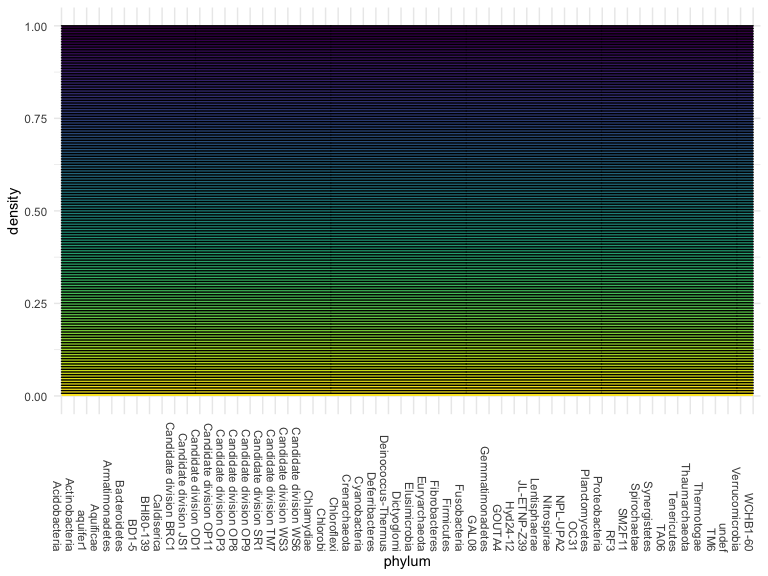
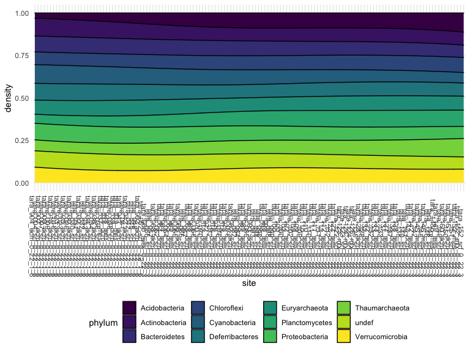

Data Analysis: Tara Ocean 16s OTU
================
Shane
2020-11-12

## Data import

``` r
otu = read_tsv("data/miTAG.taxonomic.profiles.release.tsv") %>% 
  janitor::clean_names()
```

    ## Parsed with column specification:
    ## cols(
    ##   .default = col_double(),
    ##   Domain = col_character(),
    ##   Phylum = col_character(),
    ##   Class = col_character(),
    ##   Order = col_character(),
    ##   Family = col_character(),
    ##   Genus = col_character(),
    ##   OTU.rep = col_character()
    ## )

    ## See spec(...) for full column specifications.

## Tidy

``` r
otu_tidy = otu %>% 
  pivot_longer(
    starts_with("tara_"),
    names_to = "site",
    values_to = "count",
    values_drop_na = TRUE,
  )

otu_site = otu_tidy %>% 
  select("site", "phylum", "count") %>% 
  arrange(site, desc(count))
```

## Basic plotly

    type_count_plotly = function(x) {
      
      count_plotly = otu_tidy %>% 
      filter(otu.rep == x) %>% 
      mutate(type =fct_reorder(site, count)) %>% 
      plot_ly(x = ~site, y = ~count, color = ~site, type = "bar", colors = "viridis")
      
      count_plotly
      
    }
    
    type_count_plotly("AACY024102418.157.1623")
    
    output = map(.x = otu_nest, ~ type_count_plotly(.x))

## Cumulative histogram

``` r
ggplot(data=otu_site, aes(x=phylum, group=site, fill=site)) +
  geom_density(adjust=1.5, position="fill") +
  theme(axis.text.x = element_text(angle = 270, hjust = 1), legend.position = "none")
```



``` r
otu_sum = 
  otu_site %>%
  group_by(site, phylum) %>%
  summarise_each(funs(sum)) %>% 
  filter(count > 1000)

ggplot(data = otu_sum, aes(x=site, group=phylum, fill=phylum)) +
  geom_density(adjust=1.5, position="fill") +
  theme(axis.text.x = element_text(angle = 270, hjust = 1))
```



``` r
prct = function(x) {
  
  round(x / sum(x) * 100, 5)
  
}
```
